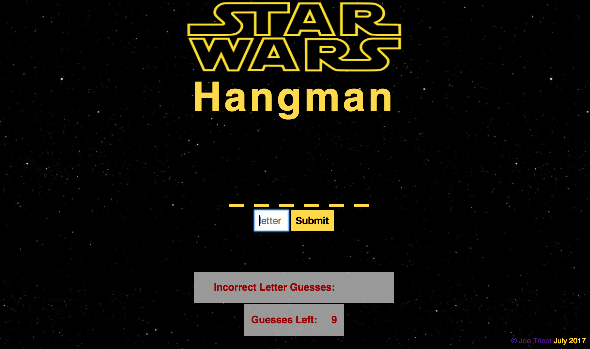

# Star Wars Hangman

## What is Hangman?

I decided to create a classic hangman game with a Star Wars twist. In this one player game, the player must guess a word within the Star Wars universe with 9 tries.

## Technical Discussion

I used HTML, CSS, and JavaScript (vanilla JS) for this game.

### Notes on Game Structure

One challenge I had in this game was deciding how I can make empty lines appear but have the actual letter hidden. I decided to make two separate divs - one with a border bottom property and one with a visibility hidden property which stores the letter.
I also had to think about how best to unhide the letters once a user inputs - the best way to do that was with an array, especially to avoid a player guessing a letter that appears one at a time in a word that contains two or more of the same letter.

## Opportunities for Future Growth
- Player can't guess a number or a letter that's already been guessed
- add restart button
- Add landing page with star wars crawl
- Create lightsaber divs for the letters to appear on
- Add sound effects
- Add local storage to detect what words the person did and not include them on a restart
