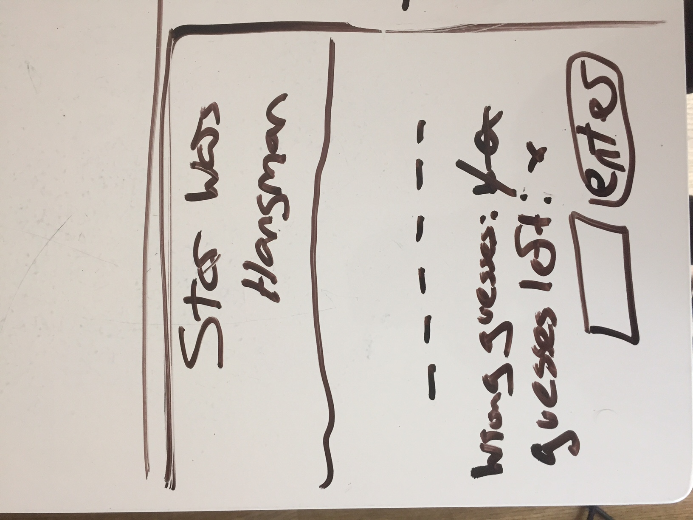
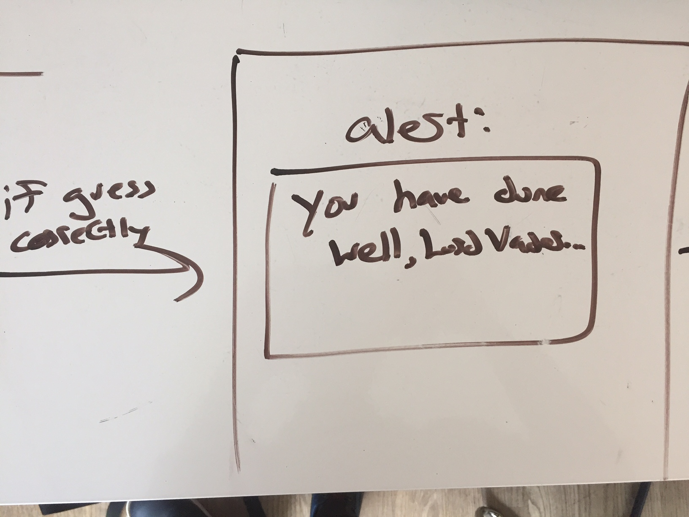
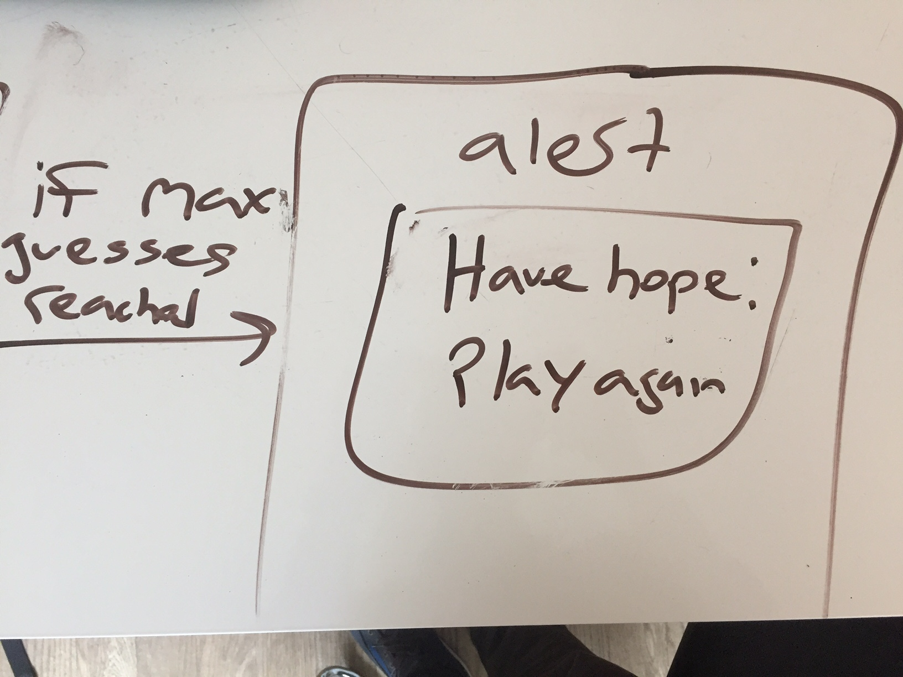

**Joe Tricot** / **July 11, 2017**

# Star Wars Hangman Proposal

## What is Hangman?

Hangman is a game in which one player must guess the letters to a word unbeknownst to them.
The player will have a certain number of guesses. With each wrong guess, a body being hung is drawn until the maximum guesses have been reached and the person is hung.

## Wireframes

## Initial thoughts on game structure

I will create a Star Wars themed Hangman game. A player will have a maximum of 5 letters to guess.
The page will have a background of black with stars and the top of the page will feature the words
"Star Wars Hangman" in the classic Star Wars font.
I will have to create an array of words and have those words chosen at random to be placed on the board.
The words must remain hidden, only to be shown upon an entrey by the user of the appropiate letter.
With every letter entry that does not equal to a letter in the word, that letter will appear with a strikethrough near "wrong guesses". The number one will also be decreased from the default number of 5 near "guesses left".
Upon completion of the entire word, an alert will appear signfying a win.
Upon the "guesses left" hitting 0, an alert will appear signifying a loss/

## Phases of completion

 - Phase -2
    - creating the page stylistically using html/css
        - implement star wars css font
        - implement background image of space
    - creating a button "enter" and a space where the user can enter a letter
    - creating a wrong guesses left container and a guesses left container
 - Phase -1
    - creating an array of possible words
    - randomizing those words and place into a function
    - hide the full word
    - show a letter in the word only if a letter entered by the user equates to a letter in the word
    - with every wrong letter guess, have that letter appear with a strikethrough
        - also, decrease one from the default number of 5 near "guesses left".
 - Phase 0
    - create a function that reads if all the letters in the word have been accurately guessed
        - check value of visibility properties of elements on a page
        - loop through all letters to see if all visible
        - easier way: each time they guess correctly, subtract letter from the total lenght. if numbers (letters remaining) = 0....create an alert signifying a win
    - create a function that reads if guesses left equals to -
        - create an alert signifying a loss

## Challenges

spans (give class to each span) to make letters inline
use css to draw thin rectangle under each letter so that's not hidden
word on the screen - break into letters
container per letter
visibility property in css
in for loop have selectors - loop through containers or divs of each letter

have class for each letter

split apart words from array into individual characters with string.prototype.split:

if letter entered equals a letter in the word
$(.letterbox) if yes, then reveal

(win condition invisible - game board disappears...)

make box bigger if longer word

make div for letters a lightsaber

## Psuedocode

HTML/CSS

Js
//Make an array of words
//Randomize those words in a function and put that into a variable
//Split the word into letters

//make word appear on the mainbox div smallbox
//have letters in the word === smallbox divs (with border bottom)
//make word invisible using css visibility
//create if statement comparing letter in word to the submit output letter:
  //if the output letter === letter on the divs
    //then make that letter visible
  //else:
    //decrease one from the guessesleft div
    //add the output letter to the incorrectletters div, with a line-through
//create gamelost function:
  //if the guesses left number === 0, then alert game over
//create gamewon function
  //if all letters in the mainbox div are visible, then alert game won

//clear the page

## To do later

Add landing page with star wars crawl (see photos)
Create lightsaber divs for the letters

## Links and resources

http://jessefreeman.com/game-dev/intro-to-programming-for-games-with-javascript/
https://www.codecademy.com/courses/javascript-intermediate-tpoPb/0/1
https://codepen.io/offline_blogger/pen/Kedtr
+ continue to read Effective JavaScript
